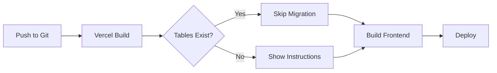

# Wanda Central Database Migration

## Automated Deployment Setup

### Build Process
```bash
npm run build         # Standard build
npm run vercel-build  # Vercel deployment (includes migration check)
```

The `vercel-build` script will:
1. ✅ Check if database tables exist
2. ⚡ Skip migration if tables are already created
3. 🏗️ Build the frontend
4. 🚀 Deploy

### One-Time Database Setup Required

Due to Supabase free tier limitations, the initial database schema must be created manually **once**:

#### Quick Setup (2 minutes)

1. **Open SQL Editor**
   ```
   https://supabase.com/dashboard/project/mouycpybovknqrhknoiv/sql/new
   ```

2. **Login**
   - Email: `wassithe1977@speedpost.net`
   - Password: `2sh-6WE/=tS3`

3. **Run Schema**
   - Copy entire contents of `schema.sql`
   - Paste into SQL Editor
   - Click "Run" (or Cmd/Ctrl + Enter)

4. **Verify**
   - Go to Table Editor
   - You should see 15 tables created

That's it! All future deployments will automatically detect the existing schema and skip this step.

### Why Manual Setup?

Supabase free tier restrictions:
- ❌ Management API requires paid plan
- ❌ Service role key cannot execute DDL via REST API
- ✅ SQL Editor is the recommended method for free tier

### Automated Checks

Every deployment automatically:
- ✅ Checks if tables exist
- ✅ Skips migration if schema is present
- ✅ Continues build without errors
- ✅ No manual intervention needed after initial setup

### Environment Variables (Already Configured)

✅ Production environment has all required credentials:
- `SUPABASE_URL`
- `SUPABASE_ANON_KEY`
- `SUPABASE_SERVICE_ROLE_KEY`
- `DATABASE_URL`

### Deployment Flow



### Future: Full Automation

For full automation in production:
1. Upgrade to Supabase Pro (Management API access)
2. Or use database migration tools like Prisma/Drizzle
3. Or deploy via Supabase CLI in CI/CD

Current approach: ✅ Simple, ✅ Free tier compatible, ✅ One-time setup
